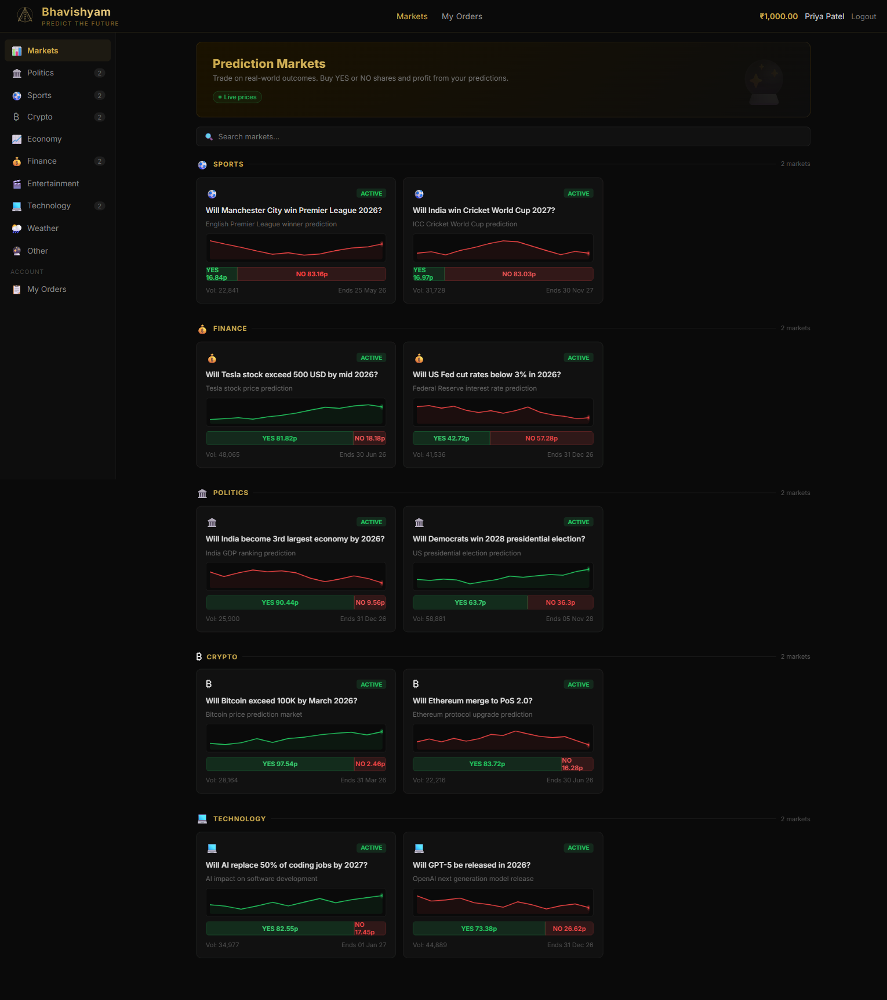
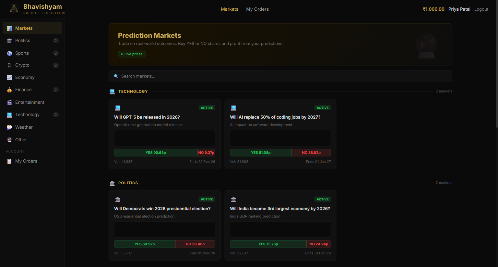

# Bhavishyam — Predict the Future 🔮

A real-time prediction market platform where users trade on real-world outcomes by buying YES or NO shares. Built with Angular 19 and Spring WebFlux microservices, featuring live price updates, sparkline charts, and an event-driven architecture powered by Kafka.

Inspired by [Kalshi](https://kalshi.com).

## Screenshots

| Markets View | Live Charts |
|---|---|
|  |  |

## Features

- Real-time price updates via WebSocket with flash animations
- Live sparkline charts (Canvas-based) per market card
- Category-based market browsing (Politics, Sports, Crypto, Social Media, etc.)
- Order placement (BUY/SELL on YES/NO shares)
- Wallet with deposit/withdrawal and balance tracking
- Separate admin panel at `/admin/` (restricted to admin user)
- Price simulator generating random fluctuations every 5 seconds
- Black & gold theme with responsive layout

## Tech Stack

| Layer | Technology |
|---|---|
| Frontend | Angular 19, Signals, RxJS WebSocket, TypeScript 5.6 |
| Backend | Spring Boot 3.2, Spring WebFlux, R2DBC, Reactor |
| Messaging | Apache Kafka (Confluent 7.5) |
| Database | PostgreSQL 15 (one per service) |
| Proxy | Nginx (reverse proxy + WebSocket upgrade) |
| Containers | Docker & Docker Compose |

## Architecture

See [ARCHITECTURE.md](ARCHITECTURE.md) for the full architecture document.

```
┌─────────────┐     ┌──────────────────────────────────────────────┐
│   Browser    │────▶│  Nginx (:80)                                 │
│  Angular 19  │◀────│  /api/* → microservices, /ws → trading-svc   │
└─────────────┘     └──────┬──────────┬──────────┬──────────┬──────┘
                           │          │          │          │
                    ┌──────▼───┐ ┌────▼─────┐ ┌─▼────────┐ ┌▼──────────┐
                    │ User Svc │ │Market Svc│ │Trading Svc│ │Wallet Svc │
                    │  :8081   │ │  :8082   │ │  :8080    │ │  :8083    │
                    └────┬─────┘ └────┬─────┘ └─────┬─────┘ └─────┬─────┘
                         │            │             │             │
                    ┌────▼─────┐ ┌────▼─────┐ ┌────▼──────┐ ┌────▼─────┐
                    │ PG Users │ │PG Markets│ │PG Trading │ │PG Wallet │
                    │  :5432   │ │  :5433   │ │  :5434    │ │  :5435   │
                    └──────────┘ └──────────┘ └───────────┘ └──────────┘
                                       │             │
                                       └──────┬──────┘
                                          ┌───▼───┐
                                          │ Kafka │
                                          │ :9092 │
                                          └───────┘
```

## Quick Start

### Prerequisites

- Docker Desktop

### Run

```bash
docker compose up --build
```

That's it. All services, databases, Kafka, and the frontend will start automatically.

Access the app at **http://localhost:4200**

### Default User

The app seeds a default user on first load:
- Name: Priya Patel
- Balance: ₹1,000.00

### Admin Panel

Navigate to **http://localhost:4200/admin/** — only user with id=1 can access the dashboard.

## Project Structure

```
bhavishyam/
├── frontend/                  # Angular 19 app
│   ├── src/app/               # Customer-facing SPA
│   │   ├── components/        # market-list, trading, navbar, etc.
│   │   ├── services/          # market, user, wallet, websocket
│   │   └── models/            # TypeScript interfaces
│   ├── src/admin/             # Separate admin Angular app
│   └── nginx.conf             # Reverse proxy config
├── market-service/            # Spring WebFlux — market CRUD + price simulator
├── trading-service/           # Spring WebFlux — orders + WebSocket server
├── user-service/              # Spring WebFlux — user management
├── wallet-service/            # Spring WebFlux — wallet & transactions
├── docker/                    # SQL init scripts per database
└── docker-compose.yml         # Full stack orchestration
```

## API Endpoints

### User Service (:8081)
| Method | Path | Description |
|---|---|---|
| POST | `/api/users` | Create user |
| GET | `/api/users/{id}` | Get user by ID |
| GET | `/api/users/email/{email}` | Get user by email |
| GET | `/api/users/{id}/balance` | Get user balance |

### Market Service (:8082)
| Method | Path | Description |
|---|---|---|
| GET | `/api/markets` | List active markets |
| GET | `/api/markets/{id}` | Get market details |
| GET | `/api/markets/category/{cat}` | Filter by category |
| POST | `/api/markets` | Create market |
| POST | `/api/markets/{id}/settle` | Settle market |

### Trading Service (:8080)
| Method | Path | Description |
|---|---|---|
| POST | `/api/trading/orders` | Place order |
| GET | `/api/trading/orders/user/{userId}` | Get user orders |
| DELETE | `/api/trading/orders/{orderId}` | Cancel order |
| WS | `/ws` | Real-time price updates |

### Wallet Service (:8083)
| Method | Path | Description |
|---|---|---|
| POST | `/api/wallet/transactions` | Create transaction |
| GET | `/api/wallet/transactions/user/{userId}` | Get transactions |

## Kafka Topics

| Topic | Producer | Consumer | Purpose |
|---|---|---|---|
| `price-updates` | market-service | trading-service | Live price changes every 5s |
| `order-events` | trading-service | wallet-service | Order placement & matching |
| `user-events` | user-service | — | User creation events |
| `market-events` | market-service | — | Market lifecycle events |

## Market Categories

🏛️ Politics · ⚽ Sports · ₿ Crypto · 📈 Economy · 💰 Finance · 🎬 Entertainment · 💻 Technology · 📱 Social Media · 🌦️ Weather

## Currency

Prices are displayed in **paisa (p)** — e.g., YES 65p / NO 35p.

## License

MIT
